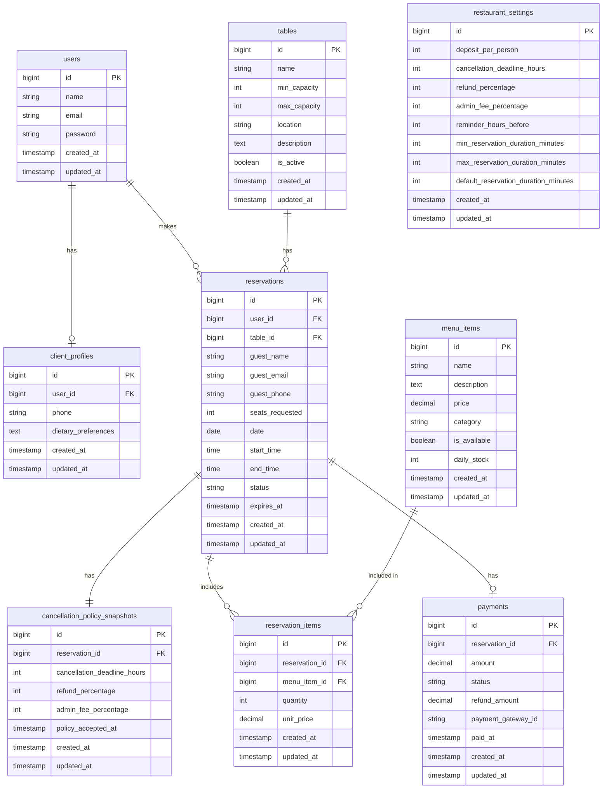

# Entity Relationship Diagram

```mermaid
erDiagram

    users {
        bigint id PK
        string name
        string email
        string password
        timestamp created_at
        timestamp updated_at
    }

    client_profiles {
        bigint id PK
        bigint user_id FK
        string phone
        text dietary_preferences
        timestamp created_at
        timestamp updated_at
    }

    tables {
        bigint id PK
        string name
        int min_capacity
        int max_capacity
        string location
        text description
        boolean is_active
        timestamp created_at
        timestamp updated_at
    }

    restaurant_settings {
        bigint id PK
        int deposit_per_person
        int cancellation_deadline_hours
        int refund_percentage
        int admin_fee_percentage
        int reminder_hours_before
        int min_reservation_duration_minutes
        int max_reservation_duration_minutes
        int default_reservation_duration_minutes
        timestamp created_at
        timestamp updated_at
    }

    reservations {
        bigint id PK
        bigint user_id FK
        bigint table_id FK
        string guest_name
        string guest_email
        string guest_phone
        int seats_requested
        date date
        time start_time
        time end_time
        string status
        timestamp expires_at
        timestamp created_at
        timestamp updated_at
    }

    cancellation_policy_snapshots {
        bigint id PK
        bigint reservation_id FK
        int cancellation_deadline_hours
        int refund_percentage
        int admin_fee_percentage
        timestamp policy_accepted_at
        timestamp created_at
        timestamp updated_at
    }

    menu_items {
        bigint id PK
        string name
        text description
        decimal price
        string category
        boolean is_available
        int daily_stock
        timestamp created_at
        timestamp updated_at
    }

    reservation_items {
        bigint id PK
        bigint reservation_id FK
        bigint menu_item_id FK
        int quantity
        decimal unit_price
        timestamp created_at
        timestamp updated_at
    }

    payments {
        bigint id PK
        bigint reservation_id FK
        decimal amount
        string status
        decimal refund_amount
        string payment_gateway_id
        timestamp paid_at
        timestamp created_at
        timestamp updated_at
    }

    users ||--o| client_profiles : "has"
    users ||--o{ reservations : "makes"
    tables ||--o{ reservations : "has"
    reservations ||--|| cancellation_policy_snapshots : "has"
    reservations ||--o{ reservation_items : "includes"
    reservations ||--o| payments : "has"
    menu_items ||--o{ reservation_items : "included in"
```
